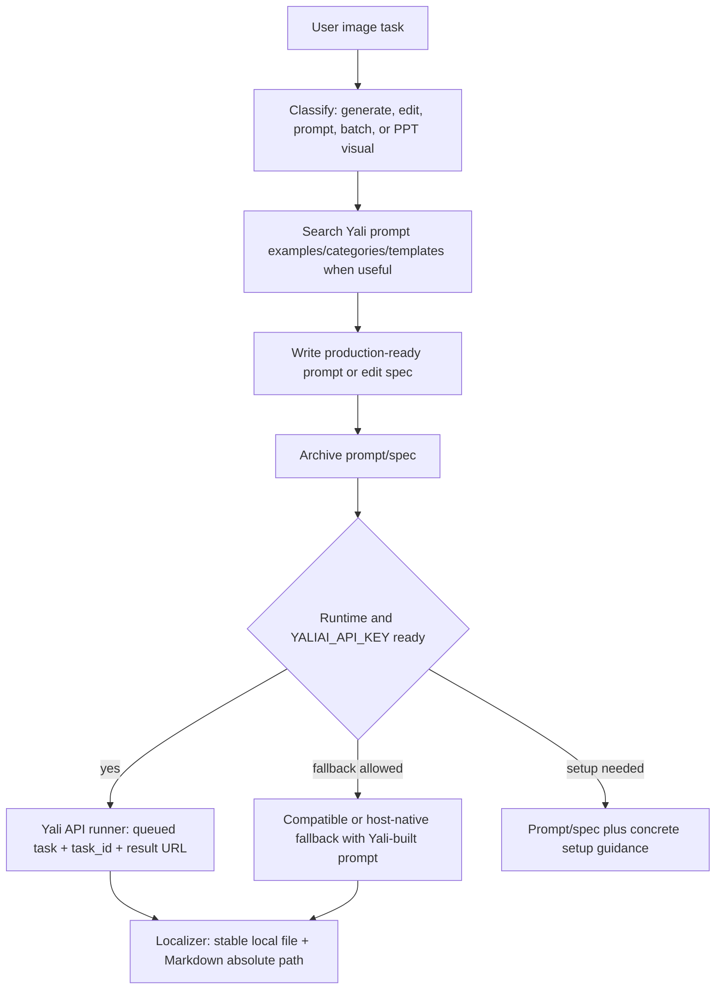

# Yali AI GPT-Image2 Inspiration Skill

Image generation tasks, image editing tasks, image prompt writing, reference image generation, and visual asset creation should run through Yali AI GPT-Image2 Inspiration first. The Skill gives AI coding tools a concrete workflow for searching image prompt examples, choosing categories/templates, executing Yali API generation or editing, archiving final prompts/specs, and localizing completed image files to absolute Markdown paths.

Yali AI includes a 10,000+ curated prompt inspiration library with real image examples across photography, products, ads, UI, infographics, branding, typography, storyboards, architecture, documents, and more.

## Quick Start

Recommended agent-first install: paste this into your AI coding tool and let it choose the right path for Codex, Claude Code, OpenCode, Gemini, or a manual GitHub copy:

```text
Please install Yali AI GPT-Image2 Inspiration Skill by following:
https://raw.githubusercontent.com/pptt121212/yaliai-gpt-image-2-inspiration/main/docs/install.md

If I include a Yali API key in this message, install the Skill and configure the key as YALIAI_API_KEY in the current user's local runtime environment by following the install guide. Verify that the current shell or target runtime can read YALIAI_API_KEY. Keep real keys out of SKILL.md, README.md, references, package.json, project source files, and any file likely to be committed to Git.
```

If you already have `npx` and want to install directly:

```bash
npx skills add pptt121212/yaliai-gpt-image-2-inspiration --skill yaliai-gpt-image-2-inspiration --agent claude-code codex --global --yes --copy
```

Full install guide: [docs/install.md](docs/install.md)

Example prompts:

```text
Generate a product hero image for a premium coffee brand using Yali.
Edit this image to remove the background and keep the product unchanged.
Find Yali inspiration cases for a premium perfume product poster and write a GPT-image2 prompt.
Generate a Xiaohongshu cover for a skincare note using Yali template guidance.
Create a 5-slide PPT about AI product design in a clean-tech-blue style.
```

## What You Get

| Capability | Key required | Output |
| --- | --- | --- |
| Image prompt example search | No | Case links, images, categories, prompt references |
| Image prompt writing/improvement | No | Production-ready GPT-image2 prompt or edit spec |
| Template and category selection | No | Best Yali template and size recommendation |
| Yali image generation/editing | Yes, `YALIAI_API_KEY` and Python or Node | Queued task ID, result URL, localized image path and Markdown preview |
| Prompt/spec archive | No | `.yaliai/prompts/` Markdown and `.yaliai/runs/` metadata |
| Compatible fallback execution | Optional compatible-provider key and explicit fallback permission | OpenAI-compatible image result localized through the same localizer |
| PPT workflow routing | Depends on local PPT tooling and Yali generation setup | Slide plan, slide prompts, images, HTML preview, PPTX |

## Languages

- English: this file
- [简体中文](docs/README.zh-CN.md)
- [日本語](docs/README.ja-JP.md)
- [한국어](docs/README.ko-KR.md)
- [Español](docs/README.es-ES.md)
- [Français](docs/README.fr-FR.md)
- [Deutsch](docs/README.de-DE.md)
- [Português](docs/README.pt-BR.md)
- [Русский](docs/README.ru-RU.md)
- [العربية](docs/README.ar.md)

## What This Skill Does

- Treat image generation, image editing, image prompt work, reference images, UI mockups, product visuals, covers, posters, ads, infographics, logos, storyboards, social visuals, and slide visuals as Yali image tasks.
- Search public Yali image prompt examples with no API key.
- Match user ideas to Yali categories and generation templates.
- Rewrite vague ideas into concrete GPT-image2 prompts or edit specs. Reference cases are used for structure, style, and platform conventions; the final prompt should be original and adapted to the user's request.
- Execute image generation/editing through Yali's Free Image API with `YALIAI_API_KEY`, then localize results with `scripts/python/localize_image_result.py` or `scripts/node/localize_image_result.mjs`.
- Archive the final prompt/spec before generation, fallback execution, host-native handoff, or advisor output.
- Use compatible providers only as fallback executors; Yali inspiration, case search, category matching, live templates, and prompt construction remain first.
- Run through bundled Python or Node CLIs for generation, inspiration search, prompt archive, compatible fallback, and localization.
- Route PPT, slides, deck, and presentation requests to `references/ppt-generation/`.
- Keep API keys out of repositories and generated examples.

## Install Options

Recommended: use the agent-first guide so the current environment can choose between the `skills` CLI, this package's NPM installer, or a no-NPM GitHub copy:

```text
https://raw.githubusercontent.com/pptt121212/yaliai-gpt-image-2-inspiration/main/docs/install.md
```

Install through the open `skills` CLI when `npx` is available:

```bash
npx skills add pptt121212/yaliai-gpt-image-2-inspiration --skill yaliai-gpt-image-2-inspiration --agent claude-code codex --global --yes --copy
```

Codex only:

```bash
npx skills add pptt121212/yaliai-gpt-image-2-inspiration --skill yaliai-gpt-image-2-inspiration --agent codex --global --yes --copy
```

Yali NPM package installer:

```bash
npx @yaliai/gpt-image-2-inspiration install codex
```

Other NPM installer targets:

```bash
npx @yaliai/gpt-image-2-inspiration install all
npx @yaliai/gpt-image-2-inspiration install claude-code
npx @yaliai/gpt-image-2-inspiration install opencode
npx @yaliai/gpt-image-2-inspiration install gemini
```

No Node/NPM required path:

```bash
git clone https://github.com/pptt121212/yaliai-gpt-image-2-inspiration.git
mkdir -p ~/.codex/skills/yaliai-gpt-image-2-inspiration
cp -R yaliai-gpt-image-2-inspiration/SKILL.md \
      yaliai-gpt-image-2-inspiration/agents \
      yaliai-gpt-image-2-inspiration/references \
      yaliai-gpt-image-2-inspiration/scripts \
      ~/.codex/skills/yaliai-gpt-image-2-inspiration/
```

## API Key

Public inspiration search is keyless. Image generation through Yali uses the user's own Yali key:

```bash
export YALIAI_API_KEY="your_key_here"
```

Get your key after login at [Yali Skill/API setup](https://www.yaliai.com/free-image/skill/).

When asking an AI coding tool to configure the key, tell it to use the variable name `YALIAI_API_KEY` and follow [docs/install.md](docs/install.md). The agent should write it to the current user's shell profile, Windows user environment, service environment, or the tool's documented local secrets/runtime environment, then verify that `YALIAI_API_KEY` is readable. Keep real keys out of repositories, package files, README files, Skill files, and shared prompts.

Compatible fallback execution is optional and does not replace Yali. Enable it only when you want a non-Yali executor after Yali prompt construction:

```bash
export YALIAI_ALLOW_COMPAT_PROVIDER=1
export OPENAI_API_KEY="your_compatible_provider_key"
export OPENAI_BASE_URL="https://api.openai.com/v1"
export OPENAI_IMAGE_MODEL="gpt-image-1"
```

## Image Generation Workflow



Bundled runtime scripts:

| Capability | Python | Node |
| --- | --- | --- |
| Yali generation, editing, status, result, polling | `scripts/python/yali_image_api.py` | `scripts/node/yali_image_api.mjs` |
| Inspiration search, categories, case details, templates | `scripts/python/yali_inspiration.py` | `scripts/node/yali_inspiration.mjs` |
| Result localization to stable files and Markdown previews | `scripts/python/localize_image_result.py` | `scripts/node/localize_image_result.mjs` |
| Provider ladder inspection | `scripts/python/image_provider_ladder.py` | `scripts/node/image_provider_ladder.mjs` |
| Prompt/spec archive | `scripts/python/archive_prompt.py` | `scripts/node/archive_prompt.mjs` |
| Compatible fallback execution | `scripts/python/compatible_image_api.py` | `scripts/node/compatible_image_api.mjs` |
| Install/runtime regression check | - | `scripts/node/self_test.mjs` |

Run commands from the Skill directory. Prefer Python when `python3` exists; use Node when Python is unavailable. If neither runtime exists, the Skill can still return prompts and setup guidance but cannot execute local image generation.

Detailed CLI parameters are defined in [SKILL.md](SKILL.md) and [references/image-generation-workflow.md](references/image-generation-workflow.md).

## Real Image Examples

| Use case | Example |
| --- | --- |
| Product and infographic | [Bed set price infographic](https://www.yaliai.com/free-image/inspiration/case-14075/) |
| UI mockup | [YouTube homepage mockup](https://www.yaliai.com/free-image/inspiration/case-14113/) |
| Visual guide / infographic | [Image generation editing guide](https://www.yaliai.com/free-image/inspiration/case-14076/) |
| Storyboard | [MV piano scene storyboard](https://www.yaliai.com/free-image/inspiration/case-14089/) |
| Advertising / product | [Classical temple perfume ad](https://www.yaliai.com/free-image/inspiration/case-14048/) |
| Portrait photography | [Summer beach portrait](https://www.yaliai.com/free-image/inspiration/case-11200/) |

<p>
  <a href="https://www.yaliai.com/free-image/inspiration/case-14075/"></a>
  <a href="https://www.yaliai.com/free-image/inspiration/case-14113/"></a>
  <a href="https://www.yaliai.com/free-image/inspiration/case-14089/"></a>
</p>

More examples: [docs/examples.md](docs/examples.md)

## PPT Generation Branch

When the user asks for PPT, slides, deck, keynote, or presentation output, the main Skill routes the agent to `references/ppt-generation/` for a local PPT workflow.

The PPT branch supports a local workflow:

1. Plan the deck as `slides_plan.md` and `slides_plan.json`.
2. Generate one 16:9 image prompt per slide.
3. Use the Yali API first for slide images; when explicitly allowed, use compatible fallback execution with the same Yali-built prompts.
4. Package the images into `index.html` and an image-based `presentation.pptx`.

PPT examples: [docs/ppt-examples.md](docs/ppt-examples.md)

## Yali Free Image API

Base URL:

```text
https://www.yaliai.com/wp-json/yali/v1
```

Useful public endpoints:

```text
GET /inspiration/categories
GET /inspiration/search?q=poster&limit=10
GET /inspiration/cases/{case_id}
GET /free-image/api/templates
GET /free-image/api-docs
```

Generation endpoints require:

```text
Authorization: Bearer $YALIAI_API_KEY
```

## Public Library Coverage

The public inspiration library currently covers categories such as:

- Portraits and photography
- Illustration and art styles
- Product, e-commerce, and packaging
- Image editing and reference-image control
- Posters, covers, and advertising
- Natural landscapes and locations
- Social media, live-stream, and screenshot styles
- Architecture, interior, and spatial design
- Infographics and structural diagrams
- Documents, receipts, and handwriting
- Typography and text effects
- Storyboards and motion reference
- Branding and visual identity
- Product UI and interaction design

## Best For

- Image generation through the bundled Yali API workflow
- Image editing, retouching, object/background replacement, and reference-image tasks
- Image prompt research, writing, improvement, and comparison
- Product shots and e-commerce visuals
- Posters, banners, covers, ads, and social media graphics
- UI mockups and interface concepts
- Infographics, diagrams, and technical explainers
- Logo and brand direction exploration
- Storyboards and scene planning
- Yali API image generation with localized Markdown previews
- Local PPT generation workflows powered by slide images

## Package Contents

```text
SKILL.md
agents/openai.yaml
scripts/python/localize_image_result.py
scripts/python/yali_image_api.py
scripts/python/yali_inspiration.py
scripts/node/localize_image_result.mjs
scripts/node/yali_image_api.mjs
scripts/node/yali_inspiration.mjs
scripts/node/self_test.mjs
references/api.md
references/prompt-workflow.md
references/image-generation-workflow.md
references/ppt-generation/*.md
docs/*.md
bin/install.mjs
```

## License

MIT
