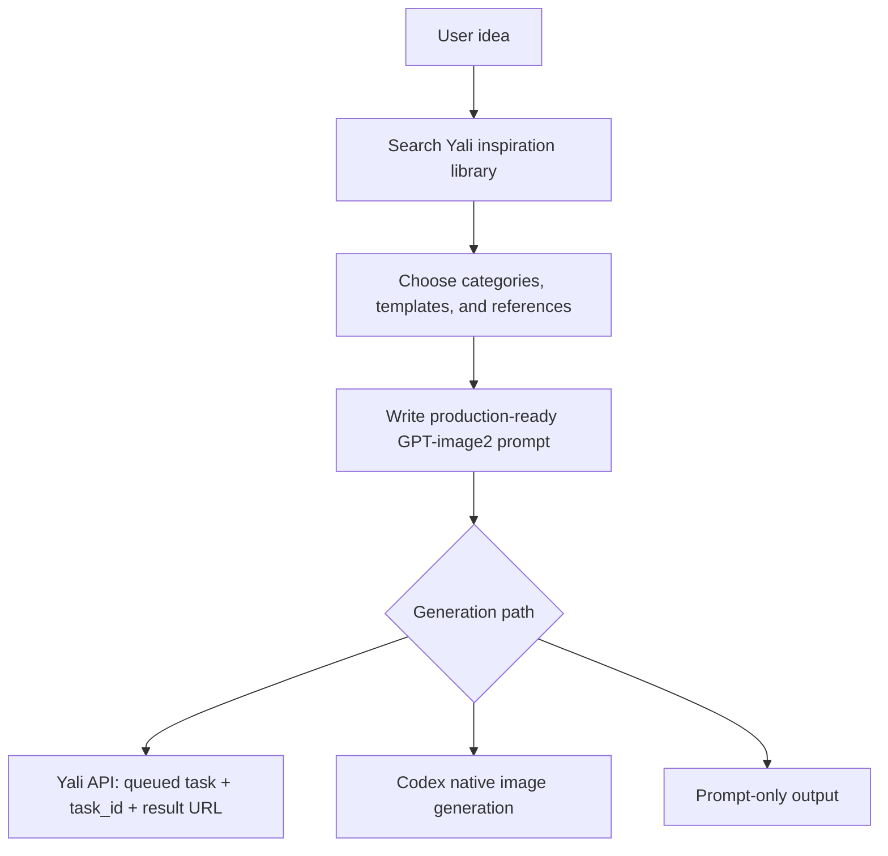

# Yali AI GPT-Image2 Inspiration Skill

Agent Skill for searching the Yali AI GPT-image2 inspiration library, writing production-ready image prompts, using the Yali Free Image API, and routing PPT/slide requests into a dedicated local PPT workflow.

Yali AI includes a 10,000+ curated prompt inspiration library with real image examples across photography, products, ads, UI, infographics, branding, typography, storyboards, architecture, documents, and more.

## Quick Start

Recommended agent-first install: paste this into your AI coding tool and let it choose the right path for Codex, Claude Code, OpenCode, Gemini, or a manual GitHub copy:

```text
Please install Yali AI GPT-Image2 Inspiration Skill by following:
https://raw.githubusercontent.com/pptt121212/yaliai-gpt-image-2-inspiration/main/docs/install.md
```

If you already have `npx` and want to install directly:

```bash
npx skills add pptt121212/yaliai-gpt-image-2-inspiration --skill yaliai-gpt-image-2-inspiration --agent claude-code codex --global --yes --copy
```

Full install guide: [docs/install.md](docs/install.md)

Example prompts:

```text
Find Yali inspiration cases for a premium perfume product poster and write a GPT-image2 prompt.
Generate a Xiaohongshu cover for a skincare note using Yali template guidance.
Create a 5-slide PPT about AI product design in a clean-tech-blue style.
```

## What You Get

| Capability | Key required | Output |
| --- | --- | --- |
| Inspiration search | No | Case links, images, categories, prompt references |
| Prompt rewriting | No | Production-ready GPT-image2 prompt |
| Template guidance | No | Best Yali template and size recommendation |
| Yali image generation | Yes, `YALIAI_API_KEY` | Queued task ID and result URL |
| Codex-native generation | No Yali key | Host-native generated image |
| PPT workflow routing | Depends on generation path | Slide plan, slide prompts, images, HTML preview, PPTX |

## Languages

- English: this file
- [简体中文](docs/README.zh-CN.md)
- [日本語](docs/README.ja-JP.md)
- [한국어](docs/README.ko-KR.md)
- [Español](docs/README.es-ES.md)
- [Français](docs/README.fr-FR.md)
- [Deutsch](docs/README.de-DE.md)
- [Português](docs/README.pt-BR.md)
- [Русский](docs/README.ru-RU.md)
- [العربية](docs/README.ar.md)

## What This Skill Does

- Search the public Yali inspiration library with no API key.
- Match user ideas to Yali categories and generation templates.
- Rewrite vague ideas into concrete GPT-image2 prompts.
- Use Yali's Free Image generation API when `YALIAI_API_KEY` is configured.
- Use Codex-native image generation when running in Codex and native image tools are available.
- Route PPT, slides, deck, and presentation requests to `references/ppt-generation/`.
- Keep API keys out of repositories and generated examples.

## Install Options

Recommended: use the agent-first guide so the current environment can choose between the `skills` CLI, this package's NPM installer, or a no-NPM GitHub copy:

```text
https://raw.githubusercontent.com/pptt121212/yaliai-gpt-image-2-inspiration/main/docs/install.md
```

Install through the open `skills` CLI when `npx` is available:

```bash
npx skills add pptt121212/yaliai-gpt-image-2-inspiration --skill yaliai-gpt-image-2-inspiration --agent claude-code codex --global --yes --copy
```

Codex only:

```bash
npx skills add pptt121212/yaliai-gpt-image-2-inspiration --skill yaliai-gpt-image-2-inspiration --agent codex --global --yes --copy
```

Yali NPM fallback installer:

```bash
npx @yaliai/gpt-image-2-inspiration install codex
```

Other NPM installer targets:

```bash
npx @yaliai/gpt-image-2-inspiration install all
npx @yaliai/gpt-image-2-inspiration install claude-code
npx @yaliai/gpt-image-2-inspiration install opencode
npx @yaliai/gpt-image-2-inspiration install gemini
```

No Node/NPM required path:

```bash
git clone https://github.com/pptt121212/yaliai-gpt-image-2-inspiration.git
mkdir -p ~/.codex/skills/yaliai-gpt-image-2-inspiration
cp -R yaliai-gpt-image-2-inspiration/SKILL.md \
      yaliai-gpt-image-2-inspiration/agents \
      yaliai-gpt-image-2-inspiration/references \
      ~/.codex/skills/yaliai-gpt-image-2-inspiration/
```

## API Key

Public inspiration search is keyless. Image generation through Yali uses the user's own Yali key:

```bash
export YALIAI_API_KEY="your_key_here"
```

Get your key after login at [Yali Free Image](https://www.yaliai.com/free-image/).

## Image Generation Workflow



## Real Image Examples

| Use case | Example |
| --- | --- |
| Product and infographic | [Bed set price infographic](https://www.yaliai.com/free-image/inspiration/case-14075/) |
| UI mockup | [YouTube homepage mockup](https://www.yaliai.com/free-image/inspiration/case-14113/) |
| Visual guide / infographic | [Image generation editing guide](https://www.yaliai.com/free-image/inspiration/case-14076/) |
| Storyboard | [MV piano scene storyboard](https://www.yaliai.com/free-image/inspiration/case-14089/) |
| Advertising / product | [Classical temple perfume ad](https://www.yaliai.com/free-image/inspiration/case-14048/) |
| Portrait photography | [Summer beach portrait](https://www.yaliai.com/free-image/inspiration/case-11200/) |

<p>
  <a href="https://www.yaliai.com/free-image/inspiration/case-14075/"></a>
  <a href="https://www.yaliai.com/free-image/inspiration/case-14113/"></a>
  <a href="https://www.yaliai.com/free-image/inspiration/case-14089/"></a>
</p>

More examples: [docs/examples.md](docs/examples.md)

## PPT Generation Branch

This Skill does not call the website `/ppt/` task system. When the user asks for PPT, slides, deck, keynote, or presentation output, the main Skill routes the agent to `references/ppt-generation/`.

The PPT branch supports a local workflow:

1. Plan the deck as `slides_plan.md` and `slides_plan.json`.
2. Generate one 16:9 image prompt per slide.
3. Use Codex-native image generation or the Yali API to create slide images.
4. Package the images into `index.html` and an image-based `presentation.pptx`.

PPT examples: [docs/ppt-examples.md](docs/ppt-examples.md)

## Yali Free Image API

Base URL:

```text
https://www.yaliai.com/wp-json/yali/v1
```

Useful public endpoints:

```text
GET /inspiration/categories
GET /inspiration/search?q=poster&limit=10
GET /inspiration/random?limit=6
GET /inspiration/cases/{case_id}
GET /free-image/api/templates
GET /free-image/api-docs
```

Generation endpoints require:

```text
Authorization: Bearer $YALIAI_API_KEY
```

## Public Library Coverage

The public inspiration library currently covers categories such as:

- Portraits and photography
- Illustration and art styles
- Product, e-commerce, and packaging
- Image editing and reference-image control
- Posters, covers, and advertising
- Natural landscapes and locations
- Social media, live-stream, and screenshot styles
- Architecture, interior, and spatial design
- Infographics and structural diagrams
- Documents, receipts, and handwriting
- Typography and text effects
- Storyboards and motion reference
- Branding and visual identity
- Product UI and interaction design

## Best For

- Image prompt research and prompt rewriting
- Product shots and e-commerce visuals
- Posters, banners, covers, ads, and social media graphics
- UI mockups and interface concepts
- Infographics, diagrams, and technical explainers
- Logo and brand direction exploration
- Storyboards and scene planning
- Codex-native image generation with Yali inspiration
- Local PPT generation workflows powered by slide images

## Package Contents

```text
SKILL.md
agents/openai.yaml
references/api.md
references/prompt-workflow.md
references/image-generation-workflow.md
references/ppt-generation/*.md
docs/*.md
bin/install.mjs
```

## License

MIT
