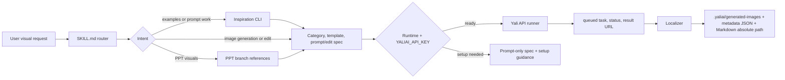

# Yali AI GPT-Image2 Inspiration

Use this skill for image prompt research, Yali inspiration search, Yali template guidance, image generation/editing, and PPT slide visual support. The workflow turns the user's visual request into a production-ready prompt or edit spec, runs the Yali queued API when generation/editing is requested and `YALIAI_API_KEY` is available, localizes finished image results, and reports Markdown previews with absolute local paths.

Yali API generation requires the user's own key from `https://www.yaliai.com/free-image/skill/`, preferably configured as `YALIAI_API_KEY`. Keep keys in the runtime environment or the user's approved secret store.

## Runtime Scripts

Use the bundled CLIs from the skill directory. Prefer Python when `python3` exists; use Node when Python is unavailable.

| Capability | Python | Node |
| --- | --- | --- |
| Yali generation, editing, status, result, polling | `scripts/python/yali_image_api.py` | `scripts/node/yali_image_api.mjs` |
| Inspiration search, categories, case details, templates | `scripts/python/yali_inspiration.py` | `scripts/node/yali_inspiration.mjs` |
| Result localization to stable files and Markdown previews | `scripts/python/localize_image_result.py` | `scripts/node/localize_image_result.mjs` |
| Install/runtime regression check | - | `scripts/node/self_test.mjs` |

If neither `python3` nor `node` is available, return the final prompt or edit spec with setup guidance. The CLIs use standard-library JSON handling and work in minimal shells.

## Execution Architecture

## Script IO Contract

| Script | Main inputs | Main outputs |
| --- | --- | --- |
| `yali_inspiration` | `search --query --limit`, `categories`, `case --case-id`, `templates` | normalized JSON: cases/templates/categories, including case IDs, image URLs, template keys, size options |
| `yali_image_api` | `generate --prompt/--prompt-file --quality --size-key --template-key --action --reference-image --wait --alt`, `status --task-id`, `result --task-id` | JSON with `task_id`, start/status/result payloads, and `localize` when a completed result is localized |
| `localize_image_result` | `--payload-file`, `--payload-json`, stdin JSON, `--out-dir`, `--alt`, `--limit` | JSON with `primary_output_path`, `primary_metadata_path`, `markdown`, and `outputs[]` |
| `self_test` | no input | JSON regression report for runtime availability, dry-runs, localizer tests, and stale instruction scans |

## References

- Read `references/api.md` for Yali endpoint fields, authentication, templates, task status, and runner examples.
- Read `references/prompt-workflow.md` for category matching, case adaptation, and final prompt construction.
- Read `references/image-generation-workflow.md` for generation/editing execution, runtime selection, localization, sizes, quality, batches, and output contracts.
- Read `references/ppt-generation/README.md` for PPT, slides, decks, presentations, keynote-style output, or multi-slide reports.

## Activation Rule

Use this skill when the user's request will likely produce, modify, research, or describe a visual asset. The user does not need to say "Yali", "template", "GPT-image2", or "prompt."

Common trigger wording includes:

- Chinese: 生成图片, 设计一张图, 做封面, 做海报, 做商品图, 做网页UI, 做App界面, 生成网站界面, 生成蓝色后台界面, 生成PPT, 做幻灯片, 改图, 修图, 换背景, 去掉某物, 替换文字, 用参考图生成.
- English: generate image, create visual, design UI, make a website mockup, product shot, poster, cover, banner, infographic, logo, storyboard, slide deck, edit image, remove object, replace background, use reference image.

For ordinary frontend or application coding, use this skill only when the user asks for generated visuals, mockup images, prompt inspiration, image assets, or slide visuals to support the coding work.

## Operating Loop

1. **Classify**: decide one intent: prompt/case search, prompt writing, template-shaped generation, new image generation, image editing, batch generation, or PPT visuals.
2. **Retrieve**: for prompt writing or broad generation, search Yali inspiration through the bundled inspiration CLI with 2-4 concise queries. Skip retrieval when the user asks for direct generation from a complete prompt, the edit is purely mechanical, or network/API access is unavailable.
3. **Match**: map the request to Yali categories and fetch live templates when the output type is explicit.
4. **Craft**: write an original prompt or edit spec that preserves the user's subject, visible text, platform, aspect/size, constraints, and edit invariants.
5. **Preflight**: verify `YALIAI_API_KEY` for Yali generation/editing, reference images for edits, template size, quality, output format, and polling/result behavior.
6. **Execute**: run the Yali queued API with `scripts/python/yali_image_api.py` or `scripts/node/yali_image_api.mjs`. For prompt-only tasks or missing setup, return the prompt/spec and the concrete setup item.
7. **Localize**: pass completed image URLs, base64 payloads, or local result paths to `scripts/python/localize_image_result.py` or `scripts/node/localize_image_result.mjs`.
8. **Report**: include provider, search queries/cases when used, template when used, final prompt/edit spec, task/result fields, localized absolute path, and returned Markdown preview.

## Capability Router

| User intent | Skill contribution | Reference | Execution |
| --- | --- | --- | --- |
| Find examples or prompts | Query public Yali inspiration APIs and summarize matching cases | `references/api.md`, `references/prompt-workflow.md` | Public Yali API |
| Write or improve prompts | Map to categories, adapt case structure, write an original prompt | `references/prompt-workflow.md` | Prompt-only unless generation is requested |
| Template-shaped visual | Fetch live templates and select a matching `template_key` | `references/api.md`, `references/prompt-workflow.md` | Public template metadata plus Yali generation when requested |
| Generate a new image | Shape prompt, size, quality, template, and visible text constraints | `references/image-generation-workflow.md` | Yali API with key, then localizer |
| Edit an image | Define edit target, invariants, allowed changes, and reference payloads | `references/image-generation-workflow.md`, `references/api.md` | Yali API with `action:"edit"` and 1-2 `reference_images`, then localizer |
| Generate PPT or slide visuals | Route to PPT branch and support slide-level visual prompts/images | `references/ppt-generation/README.md` | Dedicated PPT workflow plus Yali image path or prompt-only |

## Provider Modes

| Mode | Use when | Key requirement | Output |
| --- | --- | --- | --- |
| Public retrieval | searching examples, prompts, categories, case details, or templates | none | case/template data and adapted prompt guidance |
| Yali queued API | user wants generated or edited image files | `YALIAI_API_KEY` | `task_id`, queue/status/result metadata, localized image path and Markdown |
| Prompt-only | no generation key/runtime is available, or user asks only for prompts | none | final prompt/edit spec plus setup guidance |
| PPT branch | user asks for PPT/slides/deck/presentation | depends on image path | slide plan, slide visual prompts, generated images when available, and PPT artifacts |

Yali template keys are sent through the Yali API as `template_key`. When the Yali API cannot run, return prompt-only output with the exact setup item needed.

## Endpoint Map

Use these public endpoints for retrieval:

- Search examples: `GET https://www.yaliai.com/wp-json/yali/v1/inspiration/search?q=<query>&limit=5`
- Browse categories: `GET https://www.yaliai.com/wp-json/yali/v1/inspiration/categories`
- Case detail: `GET https://www.yaliai.com/wp-json/yali/v1/inspiration/cases/{case_id}`
- Live templates: `GET https://www.yaliai.com/wp-json/yali/v1/free-image/api/templates`

Use this authenticated endpoint for generation and editing:

- Generate or edit: `POST https://www.yaliai.com/wp-json/yali/v1/free-image/api/generate`

## Core Workflow

1. Detect the user's language and respond in that language.
2. Identify the concrete task from user wording: search cases/prompts, write or improve a prompt, generate an image, edit an image, create batch variants, or produce PPT visuals.
3. For inspiration search, use `scripts/python/yali_inspiration.py` or `scripts/node/yali_inspiration.mjs`. Public retrieval needs no API key.
4. For broad prompt work or generation, search matching cases, then write an original prompt adapted to the user's subject. Use queries for subject, output type, style, platform, and category.
5. For clear output types, fetch live templates and use a matching `template_key` only when the template clearly fits. Use the live template's `fixedSize` or best `sizeOptions` when present.
6. For image editing, define `Edit target`, `Must preserve`, `Allowed changes`, and reference-image payload rules. Use `action:"edit"` with 1-2 reference images.
7. For PPT-like requests, read `references/ppt-generation/README.md` and route to the dedicated PPT workflow. This skill supports visual inspiration, slide image prompts, and Yali image generation.
8. For generation/editing execution, read `references/image-generation-workflow.md`, choose Python or Node runtime, run the Yali API runner, wait when appropriate, and localize completed results.

## Common Task Paths

- Website, app, SaaS, dashboard, or Web UI: map to `产品界面/交互设计`; search `网站 UI`, `网页界面`, `dashboard UI`, `SaaS UI`; check `ui-mockup`; generate through Yali API when requested.
- Covers, posters, banners, ads, and social visuals: map to `海报/封面/广告`; search platform/output terms; check `wechat-cover`, `xiaohongshu-cover`, `video-cover`, or `website-banner` when explicit.
- Product, e-commerce, packaging, and mockups: map to `产品/电商/包装`; search product type plus `商品主图`, `product hero`, or `packaging`; check `product-hero`.
- Infographics, diagrams, explainers, and technical flows: map to `信息图/结构图`; search topic plus `信息图`, `diagram`, or `technical diagram`; check `infographic` or `technical-diagram`.
- Logo, typography, and brand visuals: map to `品牌/视觉规范` and/or `字体/字效设计`; search brand/style terms; check `logo-concept` when exploring marks.
- Reference-image generation and image editing: map to `图像编辑/参考图控制`; decide edit vs generation with references; use up to 2 reference images; send `action:"edit"` for edits.
- PPT, slides, and decks: route to `references/ppt-generation/README.md`; use this skill for visual style, inspiration search, slide image prompts, and Yali image generation support.

## Output Defaults

- Put the useful result first: prompt, case list, or task result.
- For generation/editing, use this shape: `Provider`, `Search`, `Reference cases`, `Template`, `Prompt/edit spec`, `Result`.
- For every successful generation/editing result, localize first. The localizer supports Yali `response.url` / `response.assets[].url`, OpenAI-style `data[].b64_json` / `data[].url`, generic `path`, `url`, `base64`, and `data:image/...` payloads.
- Default localized outputs go under the current workspace `.yaliai/generated-images/`. Use `--out-dir` when the user asks for a specific destination.
- Show image previews with the localizer's Markdown: ``.
- Also report the original remote URL when the provider returned one.
- Markdown image descriptions should be short and specific, such as `red security tools web UI`, `WeChat article cover`, or `product hero image`.
- Include case IDs and links when using references.
- Keep prompts concrete: subject, composition, style, materials, lighting, text requirements, size/aspect ratio, constraints, and avoid list.
- If the user's request is vague, present 2-3 direction options before generating.
- If no Yali API key is configured, provide the final prompt and tell the user to get/configure `YALIAI_API_KEY` from `https://www.yaliai.com/free-image/skill/`.

## API Key Rules

- Keep real API keys out of `SKILL.md`, references, GitHub examples, NPM package files, generated code samples, README files, and shared prompts.
- Use `$YALIAI_API_KEY` in examples.
- Tell users to get their own key from `https://www.yaliai.com/free-image/skill/` after login.
- Prefer environment variables over hardcoded key strings.
- The package installs the agent skill; actual generation/editing depends on a configured Yali API key and an available Python or Node runtime.
