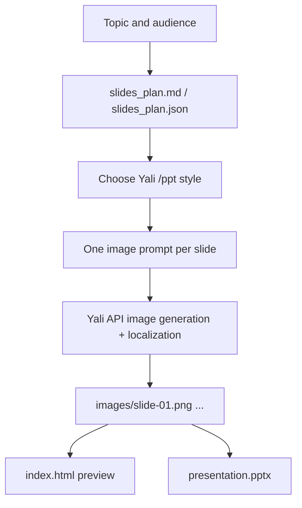
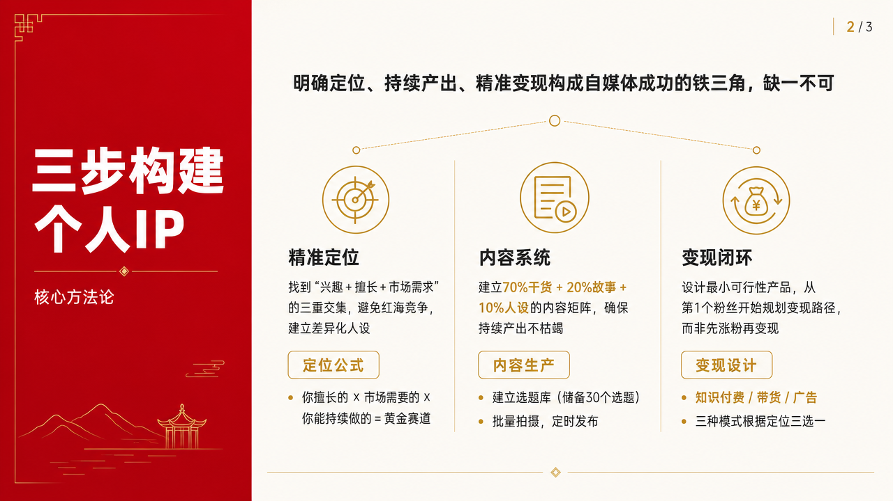
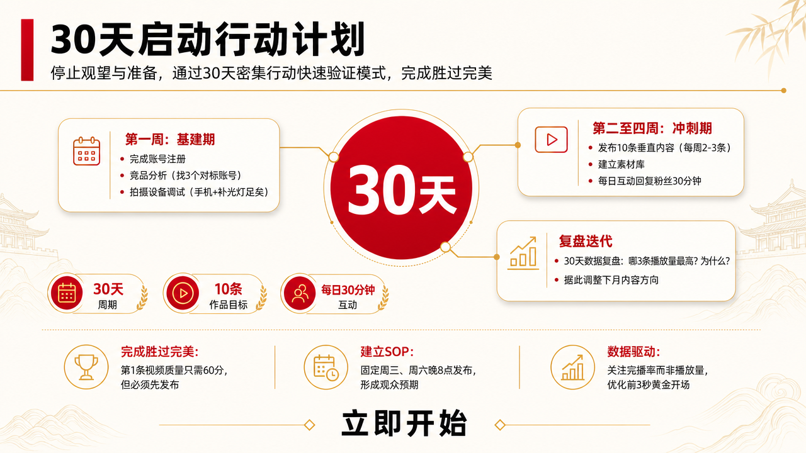

# PPT Generation Examples

The PPT branch is a local workflow driven by this Skill's routing documents under `references/ppt-generation/`: local planning, Yali slide-image generation, localization, HTML preview, and PPTX packaging.

## Example Workflow

## Example: Short China-Red Deck

Topic: `普通人如何做自媒体`

Style: `china-red-official`

Output type: image-based 16:9 PPTX with local HTML preview.

  
  
  

## Yali PPT Styles

The PPT branch uses the style set from `https://www.yaliai.com/ppt/`, including:

`gradient-glass`, `clean-tech-blue`, `china-red-official`, `soft-gradient`, `premium-dark`, `clean-data`, `luxury-serif`, `organic-paper`, `bold-pop`, `vector-illustration`, `playful-kids-illustration`, `editorial-mono`, `dark-aurora`, `risograph`, `japanese-wabi`, `east-asian-ink-luxury`, `swiss-grid`, `hand-sketch`, `y2k-chrome`, and `custom`.

## Important Boundary

PPT output is currently image-based: each slide is one generated image placed into a PPTX. This gives strong visual fidelity across PowerPoint, Keynote, WPS, and web viewers, but the text and shapes are not editable unless a future dedicated PPT workflow adds editable slide construction.
