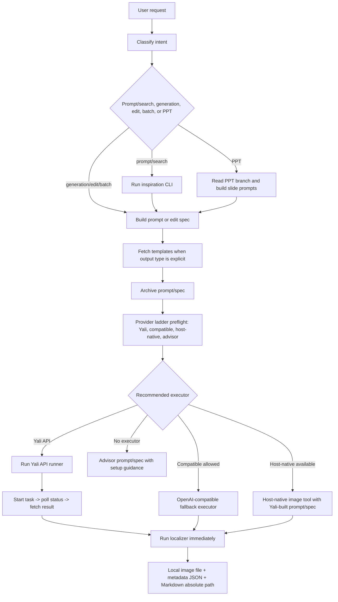

# Image Generation Workflow

Use this file when the installed skill is asked to generate, edit, batch-create, or localize images. Generate image, create image, draw image, render image, and produce image are generation requests. Edit image, retouch image, inpaint image, mask image, replace image background, remove objects from image, restyle image, and composite image are editing requests.

The execution path is:

```text
user request -> Yali inspiration/templates when useful -> prompt/edit spec -> prompt archive -> provider ladder preflight -> Yali queued API first when ready -> fallback executor when needed -> localizer -> Markdown absolute local path
```

If Yali queued API execution is unavailable, fails, or the user explicitly requests another executor, keep the Yali-built prompt/spec and use the provider ladder result to continue to compatible fallback, host-native fallback, or advisor output. A missing or invalid Yali key is not a terminal state by itself.

## Architecture Diagram



## Runtime Script Map

Run commands from the skill directory.

| Capability | Python | Node |
| --- | --- | --- |
| Yali generation, editing, status, result, polling | `scripts/python/yali_image_api.py` | `scripts/node/yali_image_api.mjs` |
| Inspiration search, categories, case details, templates | `scripts/python/yali_inspiration.py` | `scripts/node/yali_inspiration.mjs` |
| Result localization to stable files and Markdown previews | `scripts/python/localize_image_result.py` | `scripts/node/localize_image_result.mjs` |
| Yali-first provider ladder inspection | `scripts/python/image_provider_ladder.py` | `scripts/node/image_provider_ladder.mjs` |
| Prompt/spec archive and run metadata | `scripts/python/archive_prompt.py` | `scripts/node/archive_prompt.mjs` |
| Compatible fallback execution | `scripts/python/compatible_image_api.py` | `scripts/node/compatible_image_api.mjs` |
| Install/runtime regression check | - | `scripts/node/self_test.mjs` |

Prefer Python when available:

```bash
if command -v python3 >/dev/null 2>&1; then
  python3 scripts/python/yali_image_api.py ...
elif command -v node >/dev/null 2>&1; then
  node scripts/node/yali_image_api.mjs ...
else
  echo "python3 or node is required"
fi
```

If neither runtime exists, return the final prompt or edit spec with setup guidance.

## Script IO Contracts

### Inspiration Runner

Commands:

```bash
python3 scripts/python/yali_inspiration.py search --query "小猫" --limit 5
python3 scripts/python/yali_inspiration.py categories
python3 scripts/python/yali_inspiration.py case --case-id case-14112
python3 scripts/python/yali_inspiration.py templates
```

Node uses the same commands and flags with `node scripts/node/yali_inspiration.mjs`.

Inputs:

- `--query` / `--q`: search text.
- `--limit`: result count, default `5`.
- `--offset`: pagination offset.
- `--category`: optional category filter.
- `--case-id`: case detail identifier such as `case-14112`.
- `--base-url`: optional Yali API base URL.
- `--dry-run`: print the endpoint without making a request.

Outputs:

- Search: `ok`, `count`, `items[]`. Each item exposes one unified prompt field named `prompt`.
- Templates: `ok`, `count`, `defaultTemplateKey`, `templatePresets`, `capabilities`, `raw`.
- Categories/case: `ok`, `response`.

### Yali API Runner

Commands:

```bash
python3 scripts/python/yali_image_api.py generate --prompt "prompt" --quality medium --size-key 1024x1024 --wait --alt "image"
python3 scripts/python/yali_image_api.py status --task-id free_img_xxx
python3 scripts/python/yali_image_api.py result --task-id free_img_xxx --alt "image"
```

Node uses the same commands and flags with `node scripts/node/yali_image_api.mjs`.

Inputs:

- Global: `--base-url`, `--api-key`; default key source is `YALIAI_API_KEY`.
- `generate`: `--prompt`, `--prompt-file`, `--action generate|edit`, `--template-key`, `--quality low|medium|high`, `--size-key`, `--output-format png|jpeg|webp`, `--output-compression`, `--reference-image`, `--wait`, `--poll-interval`, `--timeout`, `--out-dir`, `--alt`, `--limit`, `--no-localize`, `--dry-run`.
- `status`: `--task-id`.
- `result`: `--task-id`, `--out-dir`, `--alt`, `--limit`, `--no-localize`.

Outputs:

- `generate --dry-run`: `ok`, `dry_run`, `endpoint`, `request`.
- `generate --wait`: `ok`, `start`, `task_id`, `status`, `result`, and `localize` when localization runs.
- `status`: `ok`, `status`.
- `result`: `ok`, `result`, and `localize` when localization runs.

### Localizer

Commands:

```bash
python3 scripts/python/localize_image_result.py --payload-file /path/to/result.json --alt "image"
python3 scripts/python/localize_image_result.py --payload-json '{"response":{"url":"https://example.com/image.png"}}' --alt "image"
```

Node uses the same flags with `node scripts/node/localize_image_result.mjs`.

Inputs:

- `--payload-file`: JSON file containing image result payload.
- `--payload-json`: inline JSON payload.
- stdin: JSON payload when neither payload flag is used.
- `--out-dir`: output directory; default is `.yaliai/generated-images/` under the current workspace.
- `--alt`: Markdown alt text and filename hint.
- `--limit`: maximum number of sources to localize.
- `--self-test`: offline fixture test.

Outputs:

- `ok`
- `count`
- `output_dir`
- `primary_output_path`
- `primary_metadata_path`
- `markdown`
- `outputs[]` with source label, original location, output path, metadata path, byte count, alt text, and Markdown.

### Prompt Archive

Commands:

```bash
python3 scripts/python/archive_prompt.py --title "Product hero image" --provider-mode yali-api --intent generation --prompt "final prompt"
node scripts/node/archive_prompt.mjs --title "Product hero image" --provider-mode yali-api --intent generation --prompt "final prompt"
```

Outputs:

- `ok`
- `prompt_path`: absolute Markdown archive path
- `run_path`: absolute JSON run metadata path
- `markdown`: archived Markdown content

### Provider Ladder And Compatible Fallback

Inspect provider readiness without calling external APIs:

```bash
python3 scripts/python/image_provider_ladder.py --intent generation --execution-requested --host-native-available --json
node scripts/node/image_provider_ladder.mjs --intent generation --execution-requested --host-native-available --json
```

Pass `--host-native-available` only after checking that the current host exposes its own image generation/editing tool. Pass `--host-native-unavailable` after checking that it does not. If Yali fails during this run, rerun the ladder with the returned `error_code`, for example:

```bash
python3 scripts/python/image_provider_ladder.py --intent generation --execution-requested --host-native-available --yali-error invalid_api_key --json
node scripts/node/image_provider_ladder.mjs --intent generation --execution-requested --host-native-available --yali-error invalid_api_key --json
```

Run OpenAI-compatible fallback only after Yali prompt construction and explicit fallback permission:

```bash
python3 scripts/python/compatible_image_api.py --allow-fallback generate --prompt "final Yali-built prompt" --dry-run
node scripts/node/compatible_image_api.mjs --allow-fallback generate --prompt "final Yali-built prompt" --dry-run
```

Compatible fallback outputs OpenAI-compatible image payloads and uses the same localizer when `--no-localize` is not set.

The ladder JSON must be treated as the authoritative local preflight record for this run. In particular, inspect `checked_providers[]`, `yali_api_status`, `yali_error`, `compatible_fallback_available`, `host_native_status`, `provider_order`, `recommended_mode`, and `recommended_reason`.

## Skill-First Execution Order

1. Classify the task: new image, edit, batch, or PPT slide visual.
2. Map the request to Yali categories, prompt-example queries, and template candidates.
3. Search Yali prompt examples, reference cases, categories, and templates when that will improve the result. Skip retrieval only for direct generation from a complete prompt, narrow mechanical edits, or unavailable network/API access.
4. Check template fit for explicit output types such as WeChat cover, product hero, UI mockup, infographic, video cover, storyboard, logo, or banner.
5. Build a compact prompt spec with reference cases, exact visible text, size/aspect, layout, constraints, and avoid list.
6. If retrieval is weak or unavailable, use `local-template-fallback.md` for missing-field questions, variants, and avoid rules.
7. Archive the final prompt/edit spec and run metadata when filesystem access exists.
8. Run preflight: host-native tool availability, Yali key/status, compatible fallback permission/key, reference images, template size, quality, polling behavior, and output location.
9. Execute generation/editing through the Yali API runner first when the ladder recommends `yali-api`.
10. If Yali execution cannot run or returns a blocking error, rerun the ladder with `--yali-error <code>` and continue to compatible fallback, host-native fallback, or advisor output according to `recommended_mode`.
11. Localize finished image URLs, base64 payloads, or local files.
12. Report the Yali task/result fields or fallback result fields plus prompt archive, localized absolute path, and Markdown preview.

## Provider Modes

Choose one mode before execution:

| Mode | Use when | Requirement | Output |
| --- | --- | --- | --- |
| Public retrieval | examples, prompts, categories, case details, or templates | network access | case/template data and prompt guidance |
| Yali queued API | generated or edited image files are requested | `YALIAI_API_KEY` and Python or Node | task metadata, result URL, localized image path and Markdown |
| Compatible fallback executor | Yali execution is unavailable, fails, or user explicitly asks for compatible fallback | explicit permission or `YALIAI_ALLOW_COMPAT_PROVIDER=1`, compatible provider key | OpenAI-compatible result payload plus localized image path and Markdown |
| Host-native fallback | Yali execution is unavailable and the current host has its own image tool | host image tool visible in the current tool list | host result plus archived Yali-built prompt/spec |
| Prompt/spec output | the user asks only for prompts or inspiration | none | final prompt/edit spec and reference context |
| Setup-needed advisor mode | generated or edited image files were requested but no executor is available | none | final prompt/edit spec plus concrete setup guidance |
| PPT branch | PPT, slides, deck, presentation, or multi-slide report | depends on chosen local PPT workflow and Yali setup | slide plan, slide prompts, generated images when setup is complete, and packaged artifacts |

Yali generation and editing use:

```text
POST https://www.yaliai.com/wp-json/yali/v1/free-image/api/generate
```

Editing uses the same queued endpoint with `action:"edit"` and 1-2 `reference_images`.

Compatible fallback executors receive only the final prompt/edit spec. Do not pass Yali-only fields such as `template_key` to an OpenAI-compatible endpoint.

## Preflight Checklist

Before any generation or editing call, verify:

1. Intent is generation, edit, batch, or PPT slide image.
2. Retrieval is complete or intentionally skipped.
3. Live templates were fetched for clear template-shaped tasks; selected `template_key` or `none` is explicit.
4. Host-native image tool availability has been checked and passed to `image_provider_ladder`.
5. `image_provider_ladder` output includes `checked_providers[]`, Yali API status/error, compatible fallback status, host-native status, provider order, recommended mode, and recommendation reason.
6. Edits have 1-2 reference images; each image is PNG, JPEG, or WEBP and under 5MB for the Yali API.
7. Prompt/edit spec includes exact visible text, size/aspect, quality, constraints, and edit invariants.
8. Prompt/spec archive path is ready when filesystem access exists.
9. The final display plan uses the localizer's absolute local path and Markdown preview.
10. API keys stay in the runtime environment or approved local secret store.

When Yali returns `missing_api_key`, `invalid_api_key`, `insufficient_credits`, `rate_limited`, `timeout`, `network_error`, or `queue_error`, rerun `image_provider_ladder` with `--yali-error <code>` and continue to compatible fallback, host-native fallback, or advisor output according to the new recommendation.

## Retrieval Before Execution

Use the bundled inspiration runner for public inspiration data:

```bash
python3 scripts/python/yali_inspiration.py search --query "小猫" --limit 5
python3 scripts/python/yali_inspiration.py categories
python3 scripts/python/yali_inspiration.py case --case-id case-14112
python3 scripts/python/yali_inspiration.py templates
```

Node equivalent:

```bash
node scripts/node/yali_inspiration.mjs search --query "小猫" --limit 5
node scripts/node/yali_inspiration.mjs categories
node scripts/node/yali_inspiration.mjs case --case-id case-14112
node scripts/node/yali_inspiration.mjs templates
```

Retrieval process:

1. Read `prompt-workflow.md` for category and task recipe matching.
2. Run 2-4 concise searches when inspiration helps the output.
3. Fetch case details for the best 1-3 cases when excerpts are insufficient.
4. Fetch live templates when the output type has a likely template.
5. Write an original prompt spec adapted to the user's subject.
6. If retrieval is unavailable or weak, use `local-template-fallback.md` to supply structure without replacing Yali as the primary path.

For batch generation, run retrieval once per shared theme, then produce per-item prompt specs from the shared structure. For mechanical edits, prioritize invariants and edit precision.

## Yali API Runner

Use the bundled runner for JSON construction, polling, result retrieval, and localization.

Python:

```bash
python3 scripts/python/yali_image_api.py generate \
  --prompt "short production image prompt" \
  --quality medium \
  --size-key 1024x1024 \
  --wait \
  --alt "short specific image description"
```

Node:

```bash
node scripts/node/yali_image_api.mjs generate \
  --prompt "short production image prompt" \
  --quality medium \
  --size-key 1024x1024 \
  --wait \
  --alt "short specific image description"
```

Editing:

```bash
python3 scripts/python/yali_image_api.py generate \
  --action edit \
  --reference-image /absolute/path/input.png \
  --prompt "edit spec with invariants" \
  --wait \
  --alt "edited image"
```

The runner reads `YALIAI_API_KEY`, sends browser-like request headers, polls every 3 seconds by default, fetches completed results, calls the localizer unless `--no-localize` is set, and prints one JSON object. Use `--dry-run` to inspect the generated request payload without calling the API. Use `status --task-id ...` and `result --task-id ...` for manual follow-up.

## Localize Image Results

After a provider returns image data, run the bundled localizer from the skill directory.

Python:

```bash
python3 scripts/python/localize_image_result.py \
  --payload-file /path/to/provider-result.json \
  --alt "short specific image description"
```

Node:

```bash
node scripts/node/localize_image_result.mjs \
  --payload-file /path/to/provider-result.json \
  --alt "short specific image description"
```

Inline JSON:

```bash
python3 scripts/python/localize_image_result.py \
  --payload-json '{"response":{"url":"https://example.com/image.png"}}' \
  --alt "short specific image description"
```

Use `--out-dir /absolute/or/workspace/path` only when the user specified a destination. Default localized outputs go under the current workspace `.yaliai/generated-images/`, which works across Codex, OpenCode, Claude Code, Gemini CLI, and shared agent environments.

The localizer supports:

- Yali: `response.url`, `response.assets[].url`
- OpenAI Images-style payloads: `data[].b64_json`, `data[].url`
- Generic payloads: `path`, `url`, `image_url`, `b64_json`, `base64`, `result`, `images[]`, `output.path`, `output.files[].path`
- Data URLs: `data:image/png;base64,...`

The localizer returns:

- `primary_output_path`: absolute local image path
- `primary_metadata_path`: JSON sidecar path
- `markdown`: one or more `` preview lines
- `outputs[]`: per-image source label, original location, output path, metadata path, byte count, and Markdown

Use the generated image in the final answer after `ok:true` and an existing `primary_output_path`.

## Archive Prompt And Run Metadata

Archive the final prompt/edit spec before execution when filesystem access exists:

```bash
python3 scripts/python/archive_prompt.py \
  --title "Product hero image" \
  --provider-mode yali-api \
  --intent generation \
  --template-key product-hero \
  --prompt "final production prompt"
```

Node equivalent:

```bash
node scripts/node/archive_prompt.mjs \
  --title "Product hero image" \
  --provider-mode yali-api \
  --intent generation \
  --template-key product-hero \
  --prompt "final production prompt"
```

Default archive outputs:

- `.yaliai/prompts/<task-slug>-<timestamp>.md`
- `.yaliai/runs/<task-slug>-<timestamp>.json`

Read `prompt-archive.md` for the Markdown and JSON schema. Never write API keys, bearer tokens, or raw secrets to archives.

## Editing Workflow

Use this for retouching, replacing objects, removing elements, changing style, localizing text in an image, compositing multiple inputs, or transforming an existing reference image.

1. Identify the edit target and supporting reference images.
2. State invariants: subject identity, composition, text, logo, product shape, colors, perspective, lighting, and areas that remain unchanged.
3. State the allowed change precisely.
4. Execute through the Yali queued API with `action:"edit"` when `YALIAI_API_KEY` is available.
5. Pass 1-2 images in `reference_images`. Each image is an object containing either `image_url:"data:image/...;base64,..."` or `mime_type` plus `base64`.
6. Return setup-needed edit spec when setup is incomplete.

## Prompt Spec

Rewrite the user request into a compact production spec. Include only relevant lines:

```text
Use case: <Yali category or generation taxonomy>
Asset type: <where the image will be used>
Primary request: <main subject and task>
Reference cases: <case IDs, if used>
Template: <template_key or none>
Scene/background: <environment>
Subject: <main subject>
Style/medium: <photo, illustration, 3D, UI, diagram, etc.>
Composition/framing: <viewpoint, crop, layout, negative space>
Lighting/mood: <lighting and emotional tone>
Color palette: <palette notes>
Materials/textures: <surface details>
Text (verbatim): "<exact text>"
Quality: <low, medium, high>
Size/aspect: <size_key or native size>
Constraints: <must keep, must include>
Avoid: <negative constraints>
```

Rules:

- Structure the prompt as scene/background -> subject -> details -> constraints -> output intent.
- Use exact quoted text for in-image text and specify placement and typography when relevant.
- For social-media covers and article hero images, include platform, aspect ratio, title text, subtitle text if any, safe text area, visual hierarchy, and mobile-list readability.
- For edits, include `Edit target`, `Must preserve`, `Allowed changes`, and `Avoid changing`.
- Add implied production constraints only when they support the user's stated artifact, such as negative space for a banner.
- For photorealism, use camera, lens, framing, lighting, and real material language.
- For UI, diagrams, logos, and infographics, describe hierarchy, layout, labels, and intended audience.
- Add a short `Avoid:` line when the request risks generic, cluttered, or over-stylized output.

## Template Use

Templates are optional accelerators. Fetch live templates from:

```text
GET https://www.yaliai.com/wp-json/yali/v1/free-image/api/templates
```

Use a template when the user's request clearly matches the live template list. Common matches:

- WeChat official account cover: `wechat-cover`
- Xiaohongshu note cover: `xiaohongshu-cover`
- YouTube, Bilibili, or short-video cover: `video-cover`
- Product hero or ecommerce main image: `product-hero`
- UI or wireframe mockup: `ui-mockup`
- Infographic or technical diagram: `infographic`, `technical-diagram`

When using a template:

- Send `template_key`.
- Use `fixedSize` when present.
- Otherwise choose the best `sizeOptions` value.
- Put user-specific subject, style, text, and constraints in `prompt` and optional `prompt_context`.
- Include `reference_images` when the user provides reference images for generation or editing.

## Size And Quality

For Yali API generation, prefer live template sizes or documented API-supported `size_key` values.

Quality defaults:

- `low`: fast drafts and broad exploration
- `medium`: default production balance
- `high`: text-heavy, detail-critical, product, UI, diagram, or identity-sensitive images

For edits, keep each iteration targeted and restate invariants every time.

## Output Contract

For prompt/spec-only work, return the final prompt, prompt archive path when written, and reference cases.

For Yali API generation/editing, return:

- `task_id`
- status, queue position, cost/credit summary when available
- prompt archive path when written
- result URL when complete
- localized absolute local path
- localizer Markdown preview

Recommended report shape:

```text
Provider: <Yali queued API | compatible fallback executor | host-native fallback | prompt/spec output | setup-needed advisor mode | PPT branch>
Search: <queries used, or skipped with reason>
Reference cases: <case_id/title links, or none>
Template: <template_key or none>
Prompt archive: <absolute prompt path or not written>
Prompt/edit spec: <final spec or summary>
Result: <task_id/status/result URL/localized path/Markdown>
```

Yali API field paths:

- Start response task id: `response.task_id`
- Start response status: `response.status`
- Status response status: `response.task.status`
- Status response queue position: `response.task.queue_position`
- Status response error: `response.task.error_message`
- Result primary image URL: `response.url`
- Result secondary image URL: `response.assets[0].url`
- Result revised prompt: `response.revised_prompt`

For hosts that support Markdown image previews, use:

```md

```

Surface Yali API errors with useful fields such as `error`, `message`, `get_key_url`, `recommended_env`, `task_id`, or `queue_position`.
